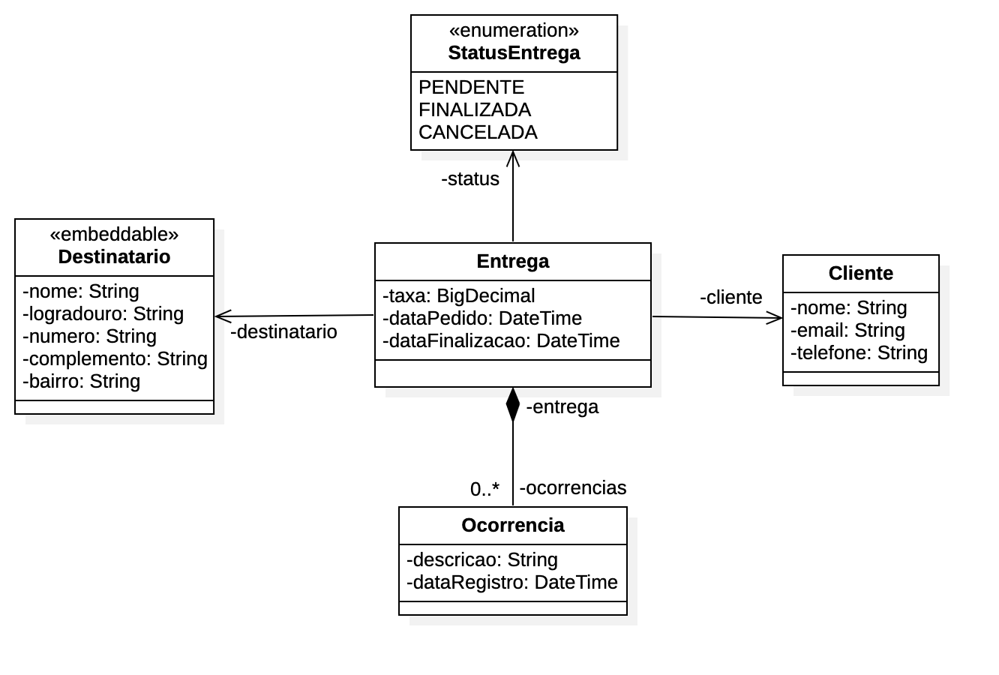

<h1> Osworks-api </h1>
Mergulho Spring Rest - Algaworks

:man_technologist:
<h4><strong>Api de um sitema de logistica </strong></h4>

 O sistema consiste em um cliente fará um pedido que contará um destinatário e endereço de entrega.

    
   <h3>Aprendizado</h3>

    Conhecimentos empregados como Spring Boot, Spring MVC, Rest, Lombok, persistência de dados em SGBD MySQL, 
    Jakarta Persistence, Spring Data JPA, Flyway, fazer validação com Bean Validation, 
    tratamento de exceptions e boas práticas de programação.
     

   

 &nbsp;
 &nbsp;
 &nbsp;
 &nbsp;

   
     

 
   
<h4>
:construction:
Projeto em construção
:hammer_and_wrench:
</h4>
